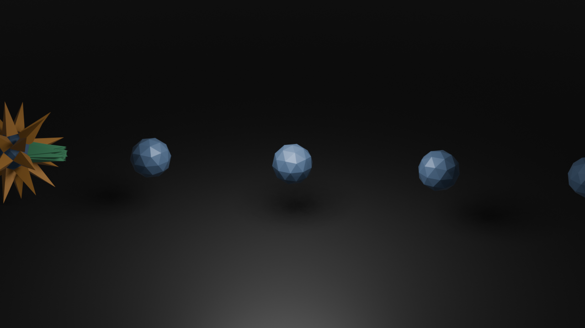

# Moravian Star — Farey Hypothesis Test

A computational test and 3D visualizer comparing the canonical 26-point Moravian (Herrnhut) star directions against 3D lifted Farey sequences and vector mediant subdivisions.



## Overview & Mathematical Background

The canonical 26-point Moravian star directions are defined by coordinate vectors:

$$\mathbf{v} \in \{-1, 0, 1\}^3 \setminus \{(0, 0, 0)\}$$

yielding $3^3 - 1 = 26$ unique direction rays.

This geometric structure consists of:
- **6 axial directions** (1 non-zero coordinate, square faces)
- **12 edge directions** (2 non-zero coordinates, square faces)
- **8 body diagonal directions** (3 non-zero coordinates, triangular faces)

### Hypothesis
For order $n = 1$, the Farey sequence is:

$$F_1 = \left\{0, 1\right\}$$

Applying independent signs and projective normalization to coordinates in $F_1$ reproduces **exactly** the 26 canonical Moravian star rays.

This project tests whether higher-order Farey sequences ($F_n$ for $n > 1$) or Farey mediant vector subdivisions generate higher-order Moravian star structures.

---

## Experimental Results

Running `moravian_farey.py` evaluates coordinate lifting for Farey orders $F_1, F_2, F_3, F_4$ as well as Farey mediant subdivision:

```text
========================================================================
MORAVIAN STAR / FAREY HYPOTHESIS TEST
========================================================================

Canonical Moravian ray count:
26

Canonical rays consist of:
  axes:              6
  edge directions:  12
  body diagonals:    8
  --------------------
  total:            26

Farey sequences (Coordinate lifting):

F_1:
    Farey fractions : 2
    3D rays         : 26
    exact overlap   : 26
    extra rays      : 0
    missing rays    : 0
    exact match     : True
    mean angle      : 0.000000 degrees
    maximum angle   : 0.000000 degrees

F_2:
    Farey fractions : 3
    3D rays         : 98
    exact overlap   : 26
    extra rays      : 72
    missing rays    : 0
    exact match     : False
    mean angle      : 13.154893 degrees
    maximum angle   : 19.471210 degrees

F_3:
    Farey fractions : 5
    3D rays         : 386
    exact overlap   : 26
    extra rays      : 360
    missing rays    : 0
    exact match     : False
    mean angle      : 16.350074 degrees
    maximum angle   : 25.239401 degrees

F_4:
    Farey fractions : 7
    3D rays         : 866
    exact overlap   : 26
    extra rays      : 840
    missing rays    : 0
    exact match     : False
    mean angle      : 15.637947 degrees
    maximum angle   : 25.239401 degrees

Farey Mediant Subdivision (Geometric recursion):

Mediant Subdivision Depth 0:
    3D rays         : 26
    exact overlap   : 26
    exact match     : True

Mediant Subdivision Depth 1:
    3D rays         : 98
    exact overlap   : 26
    extra rays      : 72
    exact match     : False
========================================================================
```

### Conclusion
1. At **Farey order $n=1$**, the correspondence is **100% exact** (26/26 rays).
2. For **$n > 1$**, the construction rapidly produces denser sets of rational directions (98 rays for $F_2$, 386 for $F_3$, 866 for $F_4$).
3. The canonical 26-point Moravian star is cleanly interpreted as the **order-1 member** of a 3D Farey-direction construction.

---

## How to Run

### Standalone Python (Report & Verification)
The script can run in standard Python environments without Blender dependencies:

```bash
python3 moravian_farey.py
```

### Run Unit Tests
To run the full unit test suite:

```bash
python3 -m unittest test_moravian_farey.py
```

### Render 3D Scene in Blender
To build and render the 3D visual comparison scene headlessly:

```bash
blender -b -P moravian_farey.py
```
This generates `farey_stars_render.png`.
